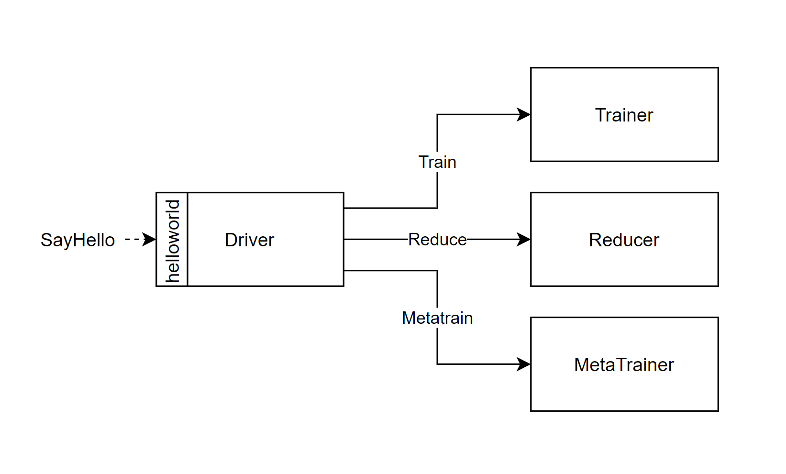

# Stacking Training


This is an ensemble training benchmark consisting of four functions:
- The **Driver** orchestrates the entire flow. It starts by uploading the dataset for the trainers
 and the metatrainer, collects the final models.
- a set of **Trainers** that fit a model each (tested with 4 and 16 trainers, sequentially and in
parallel)
- The **Reducer** collects the models and predictions from each trainer.
- The **Metatrainer** trains together with the trained models' layer, finalizing the 2-layer model.

The driver is the interface function and is invoked with a helloworld grpc call as standard.
This benchmark is unique in that it relies on S3 transfer for saving and loading models, so inline
transfer will not work.

## Running this Benchmark

1. Make sure to set the `BUCKET_NAME`, `AWS_ACCESS_KEY`, and `AWS_SECRET_KEY` environment variables.
    The kn_deploy script will then substitute these values into the knative manifests.
    Example:
    ```bash               
    export AWS_ACCESS_KEY=ABCDEFGHIJKLMNOPQRST
    export AWS_SECRET_KEY=ABCDEFGHIJKLMNOPQRSTUVWXYZABCDEFGHIJKLMN
    ```

2. Deploy the necessary functions using the `kn_deploy` script.
    ```bash
    ../../tools/kn_deploy.sh ./knative_yamls/s3/*
    ```
    Only one set of manifests is provided by default for this benchmark. All 4 of the manifests in
    the `knative_yamls/s3` folder must be deployed. These default manifests deploy functions with
    the `s3` transfer type enabled, and with tracing turned off.

3. Invoke the benchmark. The interface function of this benchmark is named `driver`. It can be
    invoked using the invoker or our test client, as described in the
    [running benchmarks](/docs/running_benchmarks.md) document.

## Instances
Number of instances per function in a stable flow:
| Function | Instances | Is Configurable |
|----------|-----------|-----------------|
| Driver | 1 | No |
| Trainer | 4 | Yes - Set in trainer knative manifest and must equal `TrainersNum` driver env var |
| Reducer | 1 | No |
| Metatrainer | 1 | No |

## Parameters

### Flags

- `tAddr` - The address of the Trainer
- `rAddr` - The address of the Reducer
- `mAddr` - The address of the Metatrainer
- `trainersNum` - The number of training models
- `sp` - The port to which the driver will listen (which is used for invokation)
- `zipkin` - Address of the zipkin span collector

### Environment Variables

- `TRANSFER_TYPE` - The transfer type to use. Can be `INLINE` (default), `S3`, or `XDT`. Not
all benchmarks support all transfer types.
- `AWS_ACCESS_KEY`, `AWS_SECRET_KEY`, `AWS_REGION` - Standard s3 keys, only needed if the s3
transfer type is used
- `BUCKET_NAME` - Set custom s3 bucket name, only needed if the s3 transfer type is used,
default bucket name is set as 'vhive-stacking'
- `ENABLE_TRACING` - Toggles tracing.
- `TrainersNum` - The number of trainers to be used.
- `CONCURRENT_TRAINING` - Toggles concurrent training. When disabled, training is carried out for
one model at a time.
