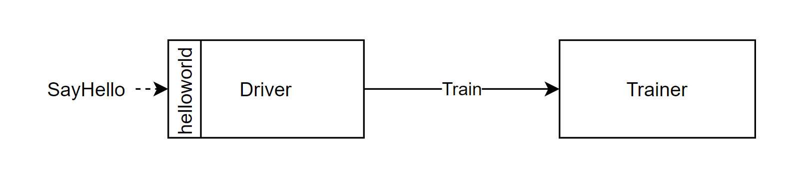

# Hyperparameter Tuning Halving


This benchmark implements iterative RandomForest training. It consists of a **Driver** function
which manages multiple training models, and a **Trainer** function used for training individual
models. The driver is the interface function implementing the standard helloworld grpc service, and
its job is to iteratively train a number of models until the best model is found.

Each iteration, the driver uses a subset of the dataset to train a number of models by issuing
requests to the training function. After training, only the top 50% of models are kept for the next
iteration, and the size of the dataset subset used for training is increased
accordingly. This is
repeated until only one model remains.

This benchmark relies on s3 for sharing models between driver and trainer.

## Running this Benchmark

1. Make sure to set the `BUCKET_NAME`, `AWS_ACCESS_KEY`, and `AWS_SECRET_KEY` environment variables.
    The kn_deploy script will then substitute these values into the knative manifests.
    Example:
    ```bash               
    export AWS_ACCESS_KEY=ABCDEFGHIJKLMNOPQRST
    export AWS_SECRET_KEY=ABCDEFGHIJKLMNOPQRSTUVWXYZABCDEFGHIJKLMN
    ```

2. Deploy the necessary functions using the `kn_deploy` script.
    ```bash
    ../../tools/kn_deploy.sh ./knative_yamls/s3/*
    ```
    Only one set of manifests is provided by default for this benchmark. Both of the manifests in
    the `knative_yamls/s3` folder must be deployed. These default manifests deploy functions with
    the `s3` transfer type enabled, and with tracing turned off.

3. Invoke the benchmark. The interface function of this benchmark is named `driver`. It can be
    invoked using the invoker or our test client, as described in the
    [running benchmarks](/docs/running_benchmarks.md) document.

## Instances
Number of instances per function in a stable flow:
| Function | Instances | Is Configurable |
|----------|-----------|-----------------|
| Driver | 1 | No |
| Trainer | 1 | No |

## Parameters

### Flags

- `tAddr` - The address of the Trainer
- `sp` - The port to which the driver will listen (which is used for invokation)
- `zipkin` - Address of the zipkin span collector

### Environment Variables

- `TRANSFER_TYPE` - The transfer type to use. Can be `INLINE` (default), `S3`, or `XDT`. Not
all benchmarks support all transfer types.
- `AWS_ACCESS_KEY`, `AWS_SECRET_KEY`, `AWS_REGION` - Standard s3 keys, only needed if the s3
transfer type is used
- `BUCKET_NAME` - Set custom s3 bucket name, only needed if the s3 transfer type is used,
default bucket name is set as 'vhive-tuning'
- `ENABLE_TRACING` - Toggles tracing.
