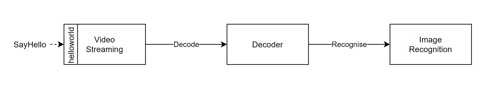

# Video Analytics


This benchmark models a video analysis system, where image recognition is performed on the
individual frames from a video feed. Three functions are involved:
- The **Streaming** function retrieves a video fragment and sends it to the decoder.
- The **Decoder** splits video fragments into individual frames which are sent to the object
recognition function
- The **Object Recognition** function (a.k.a. `recog`) performs object recognition on an image.

The video streaming function is the interface function implementing the standard helloworld grpc
service. Upon invokation, it will send the video fragment to the driver which then sends
singular frames to the recogniser. The result of the object recognition is relayed back to the 
callee, and is displayed in order from most likely to least likely tag.

## Running this Benchmark

1. If s3 is used, make sure to set the `AWS_ACCESS_KEY` and `AWS_SECRET_KEY` environment variables!
    The kn_deploy script will then substitute these values into the knative manifests.
    Example:
    ```bash               
    export AWS_ACCESS_KEY=ABCDEFGHIJKLMNOPQRST
    export AWS_SECRET_KEY=ABCDEFGHIJKLMNOPQRSTUVWXYZABCDEFGHIJKLMN
    ```

2. Deploy the necessary functions using the `kn_deploy` script.
    ```bash
    ../../tools/kn_deploy.sh ./knative/knative/s3/*
    ```
    Any sub-folder in the `knative_yamls` directory can be used, and all of the manifests therein
    must be deployed.

    `s3` contains manifests configured to use s3 for file transfer, with tracing disabled. 
    The functions deployed using this set of manifests will have `TRANSFER_TYPE` set to `S3`.

    `inline` contains manifests that use the inline transfer type with tracing disabled. 
    Functions deployed using this set of manifests will have `TRANSFER_TYPE` set to `INLINE`.

3. Invoke the benchmark. The interface function of this benchmark is named `streaming`. It can be
    invoked using the invoker or our test client, as described in the 
    [running benchmarks](/docs/running_benchmarks.md) document.

## Instances
Number of instances per function in a stable flow:
| Function | Instances | Is Configurable |
|----------|-----------|-----------------|
| Streaming | 1 | No |
| Decoder | 1 | No |
| Recog | 6 | Yes - Set in recog knative manifest and should be equal decoder `DecoderFrames`.


## Parameters

### Flags

- `addr` - The address of the Decoder
- `p` - The port used by the Decoder
- `sp` - The port to which the streaming function will listen (which is used for invokation)
- `d` - Debug toggle, enables extra logs
- `video` - The location of the video file, `reference/video.mp4` by default.
- `zipkin` - Address of the zipkin span collector

### Environment Variables

- `TRANSFER_TYPE` - The transfer type to use. Can be `INLINE` (default), `S3`, or `XDT`. Not
all benchmarks support all transfer types.
- `AWS_ACCESS_KEY`, `AWS_SECRET_KEY`, `AWS_REGION` - Standard s3 keys, only needed if the s3
transfer type is used
- `ENABLE_TRACING` - Toggles tracing.
- `DecoderFrames` - Used to set the number of frames being sent and hence the number of object
recognition function instances that are used. 6 by default.
- `CONCURRENT_RECOG` - Used in the decoder to toggle if recog functions are called concurrently.