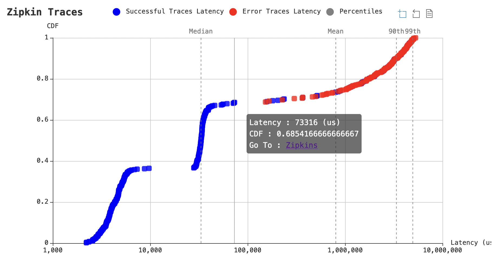

# Trace Plotter
Trace Plotter gathers traces from zipkin and provides a CDF plot of the latency.


## Zipkin Setup Instructions
**It is possible to use the zipkin api to query the traces, but it is recommended to use elasticsearch as a backend for zipkin as it will allow to load all traces.**
### Zipkin with Elasticsearch

Setup zipkin with an elasticsearch database on a k8s cluster.

[Helm](https://helm.sh) must be installed to download and deploy the charts.
Please refer to Helm's [documentation](https://helm.sh/docs/) to get started.

### Download the charts
```bash
helm repo add openzipkin https://openzipkin.github.io/zipkin
helm pull --untar openzipkin/zipkin
```

```bash
helm repo add bitnami https://charts.bitnami.com/bitnami
helm pull --untar bitnami/elasticsearch
```

### Deploy the charts
Create namespace for the charts.
```bash
kubectl create namespace elasticsearch
kubectl create namespace zipkin
```

Install each chart. Example values are provided in this repository.

```bash
helm upgrade --install -f es-example.values.yaml -n elasticsearch elasticsearch ./elasticsearch
```

```bash
helm upgrade --install -f zipkin-example.values.yaml -n zipkin zipkin ./zipkin
```

### Update vhive settings to allow tracing

```bash
kubectl patch configmap/config-tracing \
  -n knative-serving \
  --type merge \
  -p '{"data":{"backend":"zipkin","zipkin-endpoint":"http://zipkin.zipkin.svc.cluster.local:9411/api/v2/spans","debug":"true"}}'
```
Set `debug` to `true` if you want to trace all traces. Otherwise zipkin will sample traces.
### Zipkin with in-memory database

use the [setup zipkin](https://github.com/ease-lab/vhive/blob/1d1f150d3b24cb6e5f0ba1b0afff1ef40992f913/scripts/setup_zipkin.sh) script at [vhive](https://github.com/ease-lab/vhive)

## Usage
```bash
Usage of ./trace-plotter:
  -asWebServer
        Run as a webserver
  -elasticsearchURL string
        Elasticsearch URL (default "http://127.0.0.1:9200")
  -pageSize int
        Trace request page size (default 100)
  -useZipkinApi
        use zipkin api
  -zipkinURL string
        Zipkin URL (default "http://127.0.0.1:8080")
```
When `useZipkinApi` is set to `false`, elasticsearch is queried for traces, thus elasticsearch must be configured as a backend for zipkin.

If `useZipkinApi` is set to `true`, zipkin is queried for traces. The zipkin API does not support pagination, so the number of traces it can load is limited by the `pageSize` parameter. Use elasticsearch if you want to load all traces stored in zipkin.

If using `asWebServer`, a listening web server is started. The server will load all traces on reload to draw a newer graph.